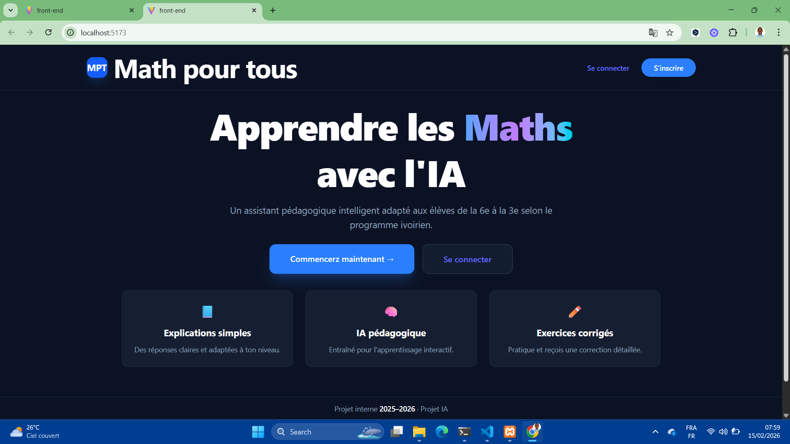
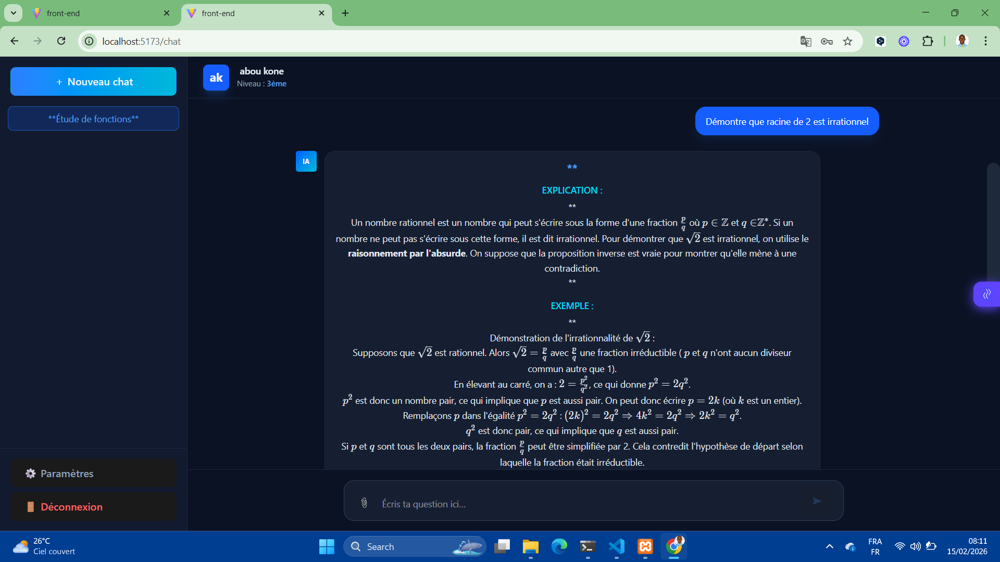

# 🎓 Agent conversationnel - Programme Ivoirien (PROJET_PI)

Ce projet est une plateforme d'apprentissage intelligente conçue pour aider les élèves de Côte d'Ivoire. Elle utilise un système hybride d'IA (Gemini 3 Flash & Qwen2-Math) pour fournir des explications pédagogiques précises et résoudre des problèmes mathématiques de la 6ème à 3ème.

---

## 🛠️ Pile Technologique 

* **Backend :** FastAPI (Python 3.10+)
* **Frontend :** Vue.js 3, Tailwind CSS, KaTeX (pour les formules)
* **IA & Données :** Gemini 3 Flash (Google), Ollama (Qwen2-math), ChromaDB (Vecteurs), SQLAlchemy (Base de données locale).

---

## 🚀 Guide d'Installation Rapide

### 1. Pré-requis
Avant de commencer, installez ces outils :
* [Python 3.10+](https://www.python.org/)
* [Node.js (LTS)](https://nodejs.org/)
* [Ollama](https://ollama.com/)

---

### 2. Configuration du Backend (Le Serveur)
Ouvrez votre terminal et suivez ces étapes :

```bash
# Entrer dans le dossier
cd backend

# Créer l'environnement virtuel
python -m venv venv

# Activer l'environnement
# Sur Windows :
venv\Scripts\activate
# Sur Mac/Linux :
source venv/bin/activate

# Installer les outils nécessaires
pip install -r requirements.txt

# Créer un fichier de configuration
# Créez un fichier nommé ".env" et ajoutez votre clé API Gemini :
# GOOGLE_API_KEY=votre_cle_ici

# Lancer le serveur
uvicorn main:app --reload

### Pour démarrer l'interface
cd frontend

# Installer les dépendances
npm install

# Lancer l'application
npm run dev
```
### Resultat : présentation de la solution

